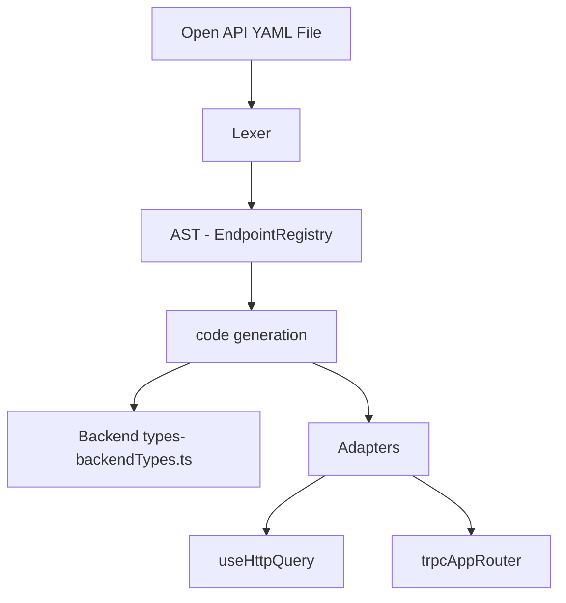

# Open API ⇒ backend types parser

## Problem:

- Communication between the frontend and the backend and the types generated by the backend are different to that expected by the frontend. There is therefore a loss in communication between the two.
- The problem has already been tried to tackle with a full blown framework [https://trpc.io/](https://trpc.io/) → but shouldn’t there be a way to make this easier?. This attempts to be a much simpler way to add end to end typesafety to \***\*any\*\*** project where the API is defined via a open-api file.
  - The issue with trpc is that it relies on a javascript/typescript server. We have a Rust server so cannot use trpc.
  - Perhaps I could somehow create a trpc `AppRouter` from the open API endpoints.
- Why is it different to https://github.com/drwpow/openapi-typescript? Potentially because it is _pluggable_ in that the AST can be used to a wide variety of things (e.g. as a react-query endpoint, as a a graphQL endpoint). Maybe good to get a deep dive in that before continuing? Or infact similar to https://github.com/ajaishankar/openapi-typescript-fetch? Also https://github.com/fabien0102/ts-to-zod?

## Hacky solution:

1. Input: Open API yml file →https://github.com/drwpow/openapi-typescript → https://github.com/fabien0102/ts-to-zod → zod-to-endpoints-library → endpointsToUseHttpAdapter (the current useHttp adapter would have to change the `assertResponseBodyShape` function and probably a similar one for the other one to include zod).

## Solution defined

1. Input: Open API yaml file:
2. Output: Typescript files of the endpoints.
3. `useHttpQuery` or `zodFetcher`
4. Typechecking on runtime so that the frontend is confident that the backend is sending what it is expecting:
   1. Using runtypes.
   2. Using zod.

## Solution as a diagram



## Example:

### Input

```yaml
# [https://support.smartbear.com/swaggerhub/docs/tutorials/openapi-3-tutorial.html](https://support.smartbear.com/swaggerhub/docs/tutorials/openapi-3-tutorial.html)
openapi: 3.0.0
info:
  version: 1.0.0
  title: Simple API
  description: A simple API to illustrate OpenAPI concepts

servers:
  - url: https://example.io/v1

components:
  securitySchemes:
    BasicAuth:
      type: http
      scheme: basic
security:
  - BasicAuth: []

paths:
  /artists:
    get:
      description: Returns a list of artists
      responses:
        "200":
          description: Successfully returned a list of artists
          content:
            application/json:
              schema:
                type: array
                items:
                  type: object
                  required:
                    - username
                  properties:
                    artist_name:
                      type: string
                    artist_genre:
                      type: string
                    albums_recorded:
                      type: integer
                    username:
                      type: string
```

## AST

```tsx
interface Endpoint {
  endpoint: string; //check to be in the structure GET etc.
  responseBody: r.Runtype; //will be good to have a invalid response body.
  //requestBody:
}

export const endpoints: Endpoint[] = [
  {
    endpoint: "GET /artists",
    responseBody: r.Array(
      r.Record({
        username: r.String,
        artist_name: r.String.optional(),
        artist_genre: r.String.optional(),
        albums_recorded: r.Number.optional(),
      })
    ),
  },
];
```

- With this AST I can do the following:

  - Convert to a types file.
  - Convert an adapter to our `useHttpQuery` hook.
  - Convert an adapter to create an `AppRouter` in `trpc`.

- output file: `getArtistsBackedTypes.ts`

```tsx
//AUTOGENERATED FILE

/*
* GET /artists
*/
export interface ArtistsGetDTO Array<{
username: string;
artist_name: string;
artist_genre: string;
albums_recorded: string;
}>

```

## Plan

- [x] Gitlab repo
- [x] Have a similar setup (with esbuild and vittest) with the engine package [https://github.com/mattpocock/ts-error-translator/tree/main/packages/engine](https://github.com/mattpocock/ts-error-translator/tree/main/packages/engine)
- [ ] User can convert a yaml file into the output AST.
  - [ ] Probably user the YAML package [https://www.npmjs.com/package/yaml](https://www.npmjs.com/package/yaml)
  - [ ] Get separate types file
- [ ] Package it up: exports one function `{createBackendTypes(openApi.yml)}`
- [x] Output ast gets converted to `getArtistsBackendTypes`.
- [ ] Can get typesafe api adapters (e.g. like the useHttpQuery)
- [x] package the module so that exposes : i) The typescript typefile
- [ ] package the module so that exposes : i) The zod fetch endpoints
- [ ] find a way to make it automatically show the appropriate types (e.g. like with http. Must somehow print the constants and export them).
- [x] make a monorepo showing examples of the typescript typefile and adapters
      It will be like a compiler:
- [x] convert to runtypes
- [x] use generate runtypes library to generate the types (i.e. the codegen stage) https://github.com/cobraz/generate-runtypes#readme
- [ ] make the build process seemless. e.g. so that it builds the runtype files then builds. (at the moment i need to run the test which is not good).
- [ ] tidy up the types and testing for the current type which is not? an array.

1. Parsing / Lexing (YAML.load)
2. AST manipulation (Array<Endpoint>)
3. Optimizations ⇒ not quite sure what we have?.
4. Code generation
